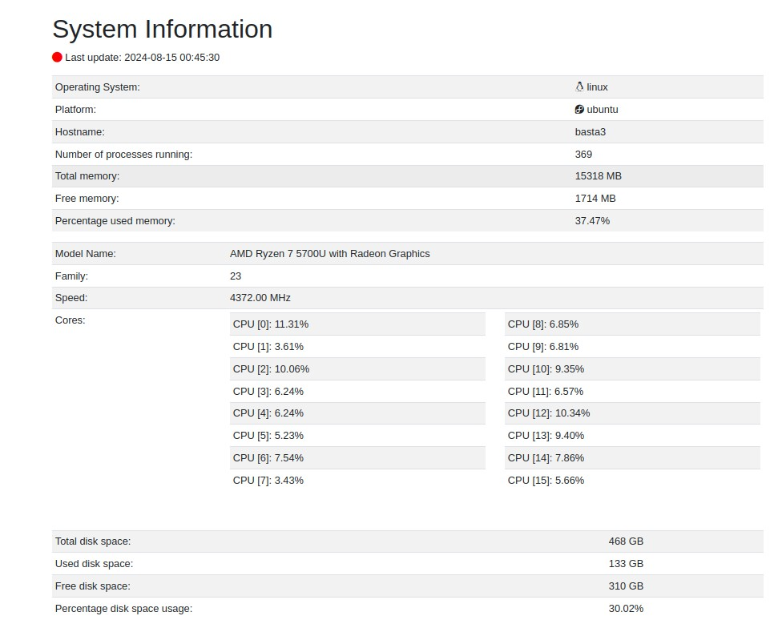

# Программа отображающая информацию о системе

* Используется технология HTMX. Системные параметры периодически публикуются-отправляются всем подключенным клиентам - секциями(все секции разом). Клиент, получив сообщения, обновляет(рендерит вновь) только те из них, которые изменились.
* Взаимодействие клиента и сервера через Websocket - "github.com/gorilla/websocket".
* Получение системных параметров - "github.com/shirou/gopsutil/v4". 

